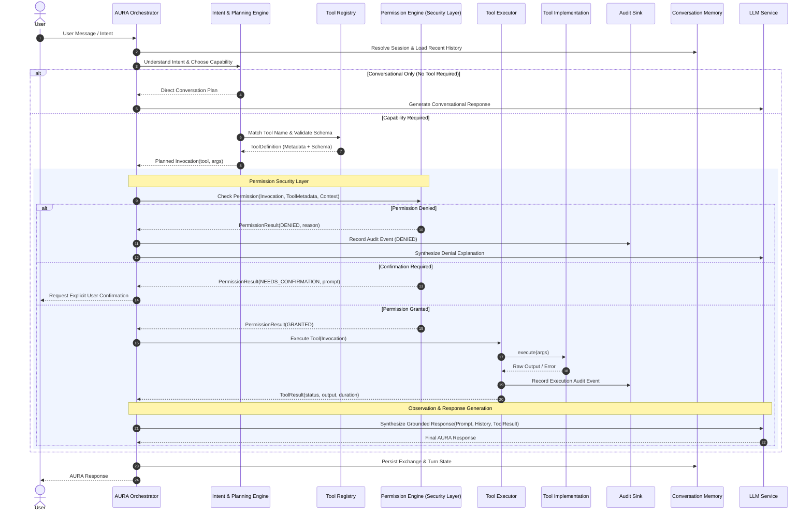

# AURA Architecture Specification: Capability Execution & Permission Security Layer

## 1. Executive Summary

This specification defines the architectural design for the end-to-end **Capability Execution Loop** and the **Permission Security Layer** within the **Autonomous Unified Reasoning Assistant (AURA)** platform.

The system expands AURA from conversational turn management (`v0.3`) into an active autonomous agent platform (`v0.4+`) capable of understanding intent, selecting appropriate capabilities/tools, enforcing granular security policies, executing actions across safe fault boundaries, observing outcomes, and synthesizing contextual user responses.

---

## 2. High-Level Architecture Flow



---

## 3. Core Architectural Stages

### Stage 1: User Request Ingestion
- **Entry Point**: REST API (`/chat`), WebSocket, or CLI interface.
- **Payload**: `message`, `session_id`, client `metadata`, and authorization context (user role, client device class).

### Stage 2: Orchestration Coordination
- Managed by `AuraOrchestrator`.
- Retrieves active session context, system prompt, and sliding history window from `ConversationManagerProtocol`.
- Coordinates lifecycle stages with clear transaction isolation and error containment.

### Stage 3: Intent Understanding & Capability Selection
- **Role**: Determine whether the user's turn requires external action (tool invocation) or conversational reasoning.
- **Mechanisms**:
  1. **Schema-guided Tool Calling**: Passing registered tool specifications (`name`, `description`, `input_schema`) to the LLM via tool-use prompting or native tool calling.
  2. **Intent Classifier / Router**: Fast-path classification for common commands vs complex reasoning queries.
  3. **Invocation Formulation**: Constructs an immutable `ToolInvocation` with typed argument dictionary and a cryptographically unique `invocation_id`.

### Stage 4: Permission Security Layer (`backend/app/permissions`)
The primary defense-in-depth gate between reasoning and system execution.

#### 4.1 Threat Model & Security Principles
- **Least Privilege**: Capabilities operate with minimal permissions; access defaults to denied if unconfigured.
- **Defense in Depth**: Permissions are evaluated prior to invocation execution, independent of LLM decisions.
- **Explicit User Consent for High-Risk Actions**: Potentially destructive, modifying, or external network actions require human authorization.
- **Non-Repudiation**: Every decision (grant, deny, confirmation) is permanently logged to an append-only audit trail.

#### 4.2 Risk Level Matrix
Aligned with `RiskLevel` in `backend/app/tools/models.py`:

| Risk Level | Description | Example Capabilities | Default Policy |
| :--- | :--- | :--- | :--- |
| `SAFE` | Pure read-only, non-sensitive, computational operations | `calculator`, `current_time`, `echo` | **Auto-Approve** |
| `LOW` | Read-only access to non-sensitive filesystem or local state | Read file in sandbox, list status | **Auto-Approve** (configurable) |
| `MEDIUM` | External network GET requests, non-destructive app actions | HTTP fetch, search web, notify desktop | **Approve with Session Scope** |
| `HIGH` | Local file write/modify, system configuration changes | Write file, update schedule, modify config | **Interactive Confirmation** |
| `CRITICAL` | Shell command execution, file deletion, credentials access | `run_command`, delete directory, credential retrieval | **Mandatory Explicit Confirmation** |

#### 4.3 Permission Policy Evaluation Pipeline
The permission gate evaluates five dimensions:
1. **Tool State**: `metadata.enabled` must be true.
2. **Execution Mode**:
   - `STRICT`: Only `SAFE` tools auto-run; all others require confirmation.
   - `STANDARD` (Default): `SAFE` and `LOW` auto-run; `MEDIUM` respects session rules; `HIGH`/`CRITICAL` prompt.
   - `AUTONOMOUS` (Opt-in by user): `SAFE`, `LOW`, and `MEDIUM` auto-run; `HIGH`/`CRITICAL` require policy whitelisting.
3. **Session Permissions / Capability Allowlist**: Per-session capabilities granted by the user.
4. **Parameter Validation & Path Traversal Guards**: Checking paths against allowed working directories (e.g., sandbox restrictions).
5. **Interactive Confirmation Tokens**: Cryptographically signed confirmation challenges when user approval is needed.

### Stage 5: Tool Execution (`backend/app/tools/executor.py`)
- Executes exclusively after permission verification.
- Enforces execution fault boundary: catches timeouts, input validation errors, and runtime exceptions.
- Emits structured `ToolResult` with status: `SUCCESS`, `ERROR`, `DENIED`, `TIMEOUT`, or `INVALID_INPUT`.

### Stage 6: Audit Logging
- Emits immutable `AuditEvent` capturing:
  - `event_id`, `invocation_id`, `tool_name`
  - `session_id`, `requested_by`, `arguments`
  - `status`, `error_message`, `duration_ms`, `timestamp`
- Backed by `AuditSinkProtocol` (SQLite append-only audit table in production).

### Stage 7: Result Observation & Synthesis
- The orchestrator feeds the `ToolResult` into the context.
- The LLM formats a user-facing explanation:
  - On **Success**: Present results clearly, seamlessly integrating into the conversation.
  - On **Denial**: Inform the user why the action was rejected and offer a path to proceed.
  - On **Error**: Explain what failed gracefully without exposing raw stack traces or internal vulnerability data.

### Stage 8: Turn Persistence & Response Delivery
- Stores both the tool invocation/result observation and final assistant text in `ConversationManager`.
- Returns `OrchestratorResult` to the caller.

---

## 4. Module Specifications & Interfaces

### 4.1 Permission Engine Interface (`backend/app/permissions/`)

```python
from enum import Enum
from dataclasses import dataclass
from typing import Protocol, runtime_checkable
from backend.app.tools.models import ToolInvocation, ToolMetadata, RiskLevel

class PolicyDecision(str, Enum):
    ALLOW = "allow"
    DENY = "deny"
    CONFIRMATION_REQUIRED = "confirmation_required"

@dataclass(frozen=True)
class PermissionCheckResult:
    decision: PolicyDecision
    reason: str
    risk_level: RiskLevel
    confirmation_token: str | None = None
    confirmation_prompt: str | None = None

@runtime_checkable
class PermissionEngineProtocol(Protocol):
    def evaluate(
        self,
        invocation: ToolInvocation,
        metadata: ToolMetadata,
        context: dict[str, Any] | None = None,
    ) -> PermissionCheckResult:
        """Evaluate invocation against security policies and risk profiles."""
        ...
```

### 4.2 Adapter to ToolExecutor (`PermissionGateProtocol`)
To ensure backwards compatibility with `backend.app.tools.protocols.PermissionGateProtocol`:

```python
class SecurityPermissionGateAdapter(PermissionGateProtocol):
    """Bridges the rich PermissionEngine to the boolean PermissionGateProtocol."""
    
    def __init__(self, engine: PermissionEngineProtocol) -> None:
        self._engine = engine

    def check(self, invocation: ToolInvocation, tool_metadata: ToolMetadata) -> bool:
        result = self._engine.evaluate(invocation, tool_metadata)
        return result.decision == PolicyDecision.ALLOW
```

### 4.3 Orchestrator Integration

The orchestrator integrates `ToolRegistryProtocol`, `PermissionEngineProtocol`, and `ToolExecutor`:

```python
class AuraOrchestrator:
    def __init__(
        self,
        *,
        memory_manager: ConversationManagerProtocol,
        llm_service: LLMServiceProtocol,
        prompt_builder: PromptBuilderProtocol | None = None,
        tool_registry: ToolRegistryProtocol | None = None,
        tool_executor: ToolExecutor | None = None,
        permission_engine: PermissionEngineProtocol | None = None,
        config: OrchestratorConfig | None = None,
    ) -> None:
        ...
```

---

## 5. Implementation Roadmap

1. **Phase 1: Permission Engine Core** (`backend/app/permissions/`)
   - Domain models: `SecurityPolicy`, `PolicyDecision`, `PermissionCheckResult`.
   - Engine implementation: `RuleBasedPermissionEngine` with configurable risk rules.
   - Adapter implementing `PermissionGateProtocol` for `ToolExecutor`.
   - Unit and security tests (`tests/test_permissions.py`).

2. **Phase 2: Intent & Capability Reasoning in Orchestrator**
   - Tool definition prompt injection into `PromptBuilder`.
   - Tool call parsing and validation against `ToolRegistry`.
   - Integration of `ToolExecutor` into `AuraOrchestrator.process_turn()`.
   - Unit tests covering tool invocation, permission denial responses, and error recovery.

3. **Phase 3: Interactive Confirmation Workflow**
   - REST API endpoints for pending confirmation retrieval and resolution (`/confirmations/{token}`).
   - Multi-turn suspension and resumption for high-risk actions.
